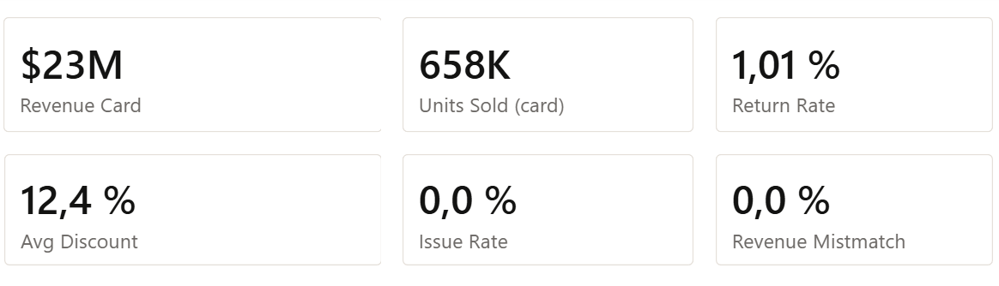
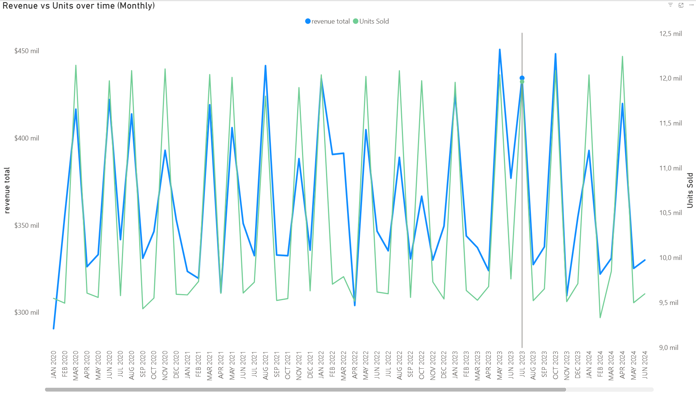
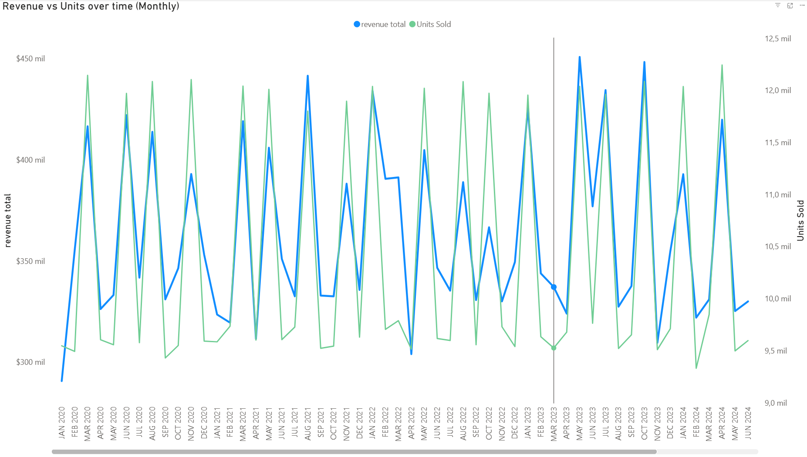
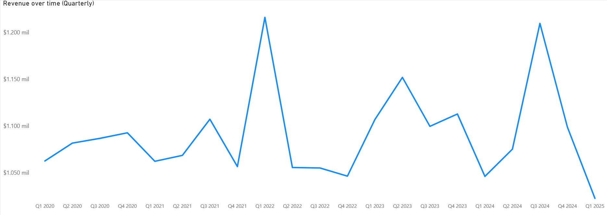
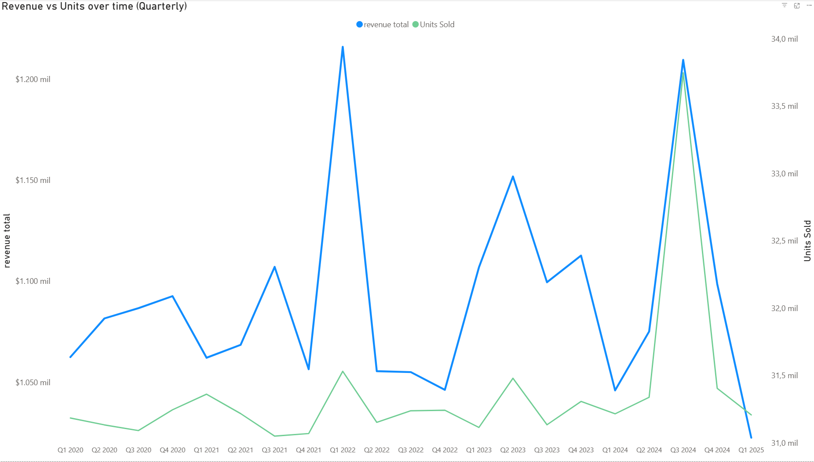
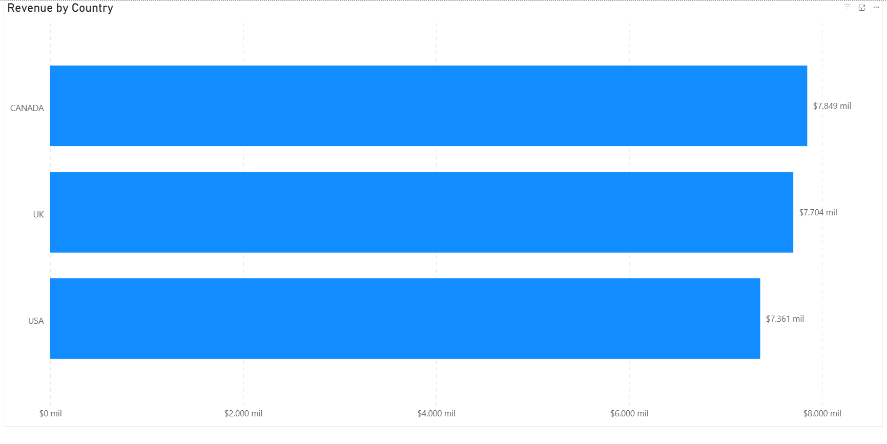
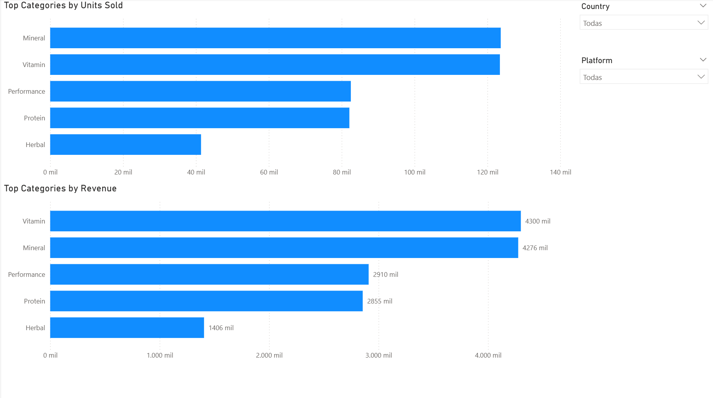
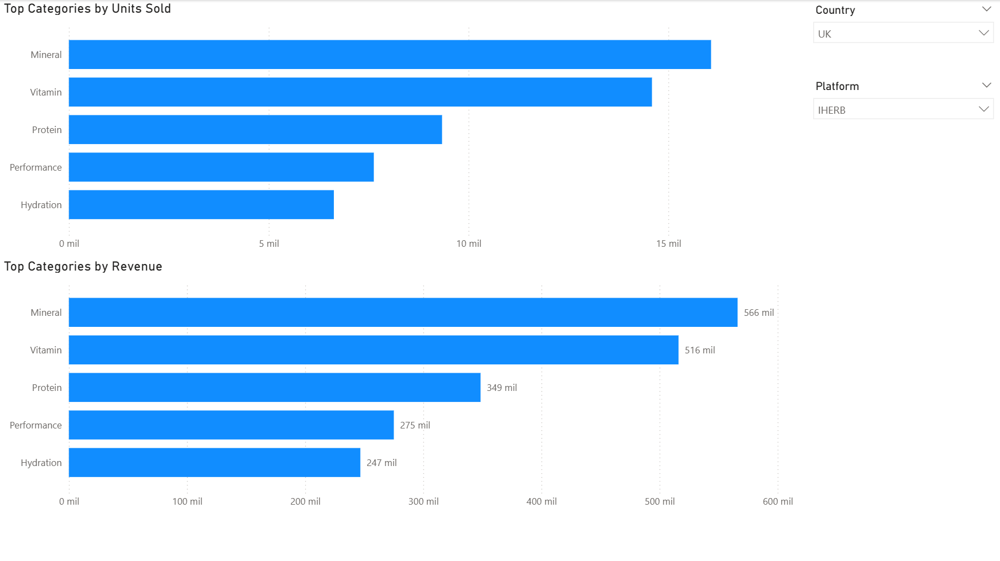
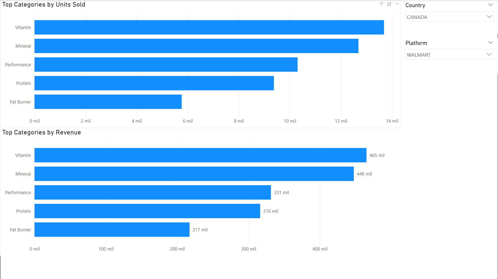

# Supplement Sales — Power BI Dashboard  
**Revenue Analysis & Data Quality Validation**

## Overview
This project presents an **executive-ready Power BI dashboard** built on top of a cleaned e-commerce dataset of nutritional supplement sales.

The objective is twofold:
1. Analyze **commercial performance** (revenue, units sold, returns, discounts) across countries, platforms, and product categories.
2. Make **data quality and metric reliability explicit**, ensuring trust in the analysis.

The dashboard is intentionally designed to reflect a **real business reporting scenario**, prioritizing:
- clear KPIs,
- filter-aware DAX measures,
- and decision-oriented visuals.

---

## Related Project — Data Cleaning & Quality Audit
The dataset used in this dashboard was previously assessed, cleaned, and audited in a separate project:

🔗 **Data Cleaning & Quality Audit (Google Sheets)**  
https://github.com/anamoya-tech/supplement-sales-data-quality

That project documents:
- Data quality checks (formats, duplicates, consistency)
- Cleaning decisions and transformation logic
- Issue and mismatch flag definitions
- BEFORE vs AFTER validation metrics

This Power BI dashboard builds directly on the **cleaned and audited output** of that pipeline.

---

## Business Questions Addressed
- What is the overall revenue and sales volume performance?
- Are revenue trends driven by **volume or pricing effects**?
- What is the average discount level across sales?
- What is the return rate?
- Are there any **data quality or revenue mismatches** that could affect trust in the analysis?
- Which product categories are **volume-driven vs value-driven**?

---

## KPI Snapshot (Executive View)
The dashboard opens with a KPI header designed for executive consumption:

- **Revenue Total:** $23M  
- **Units Sold:** 658K  
- **Return Rate:** 1.01%  
- **Average Discount:** 12.4%  
- **Issue Rate:** 0.0%  
- **Revenue Mismatch Rate:** 0.0%

Issue and mismatch rates are explicitly shown to make **data reliability transparent**.  
In this dataset, all quality issues were resolved during the cleaning phase, but these KPIs are included to demonstrate how quality monitoring would surface problems in a real production environment.

### KPI Overview

---

## Data Model & Design
- **Single cleaned fact table:** `clean_data`
- **Core dimensions:**
  - Date (standardized monthly axis)
  - Country (`location_clean`)
  - Platform / Store (`platform_clean`)
  - Product Category (`category_clean`)
- **Core metrics:**
  - Revenue
  - Units Sold
  - Units Returned
  - Discount
- **Audit indicators:**
  - Issue flags
  - Revenue mismatch flags

All KPIs are implemented as **DAX measures**, ensuring correct aggregation and responsiveness to filters.

---

## Tools & Skills Demonstrated
- Power BI Desktop
- DAX (measures, ratios, defensive calculations)
- KPI design for executive reporting
- Data quality awareness in BI
- Clean dashboard layout and formatting
- End-to-end analytical thinking (audit → reporting)

---

## Phase 1 — Performance Overview

**Goal**  
Validate overall commercial performance and identify high-level trends.

### Visuals

- **Revenue Over Time (Monthly)**  
  

- **Revenue vs Units Sold (Monthly)**  
  

- **Revenue Over Time (Quarterly)**  
  

- **Revenue vs Units Sold (Quarterly)**  
  

**Key Takeaway**  
Revenue and units sold move consistently over time, indicating that performance is primarily **volume-driven**, rather than driven by pricing distortions.

---

## Phase 2 — Country & Platform Analysis

**Goal**  
Understand where revenue is generated and how sales channels contribute within each market.

### Visuals

- **Revenue by Country**  
  

- **Platform Revenue Mix by Country (%)**  
  .png)

**Key Insights**
- Revenue is relatively well distributed across Canada, the UK, and the USA.
- No single country overwhelmingly dominates performance.
- Platform contribution is balanced within each market, reducing channel concentration risk.

---

## Phase 3 — Category Performance (Units vs Revenue)

**Objective**  
Identify top-performing product categories and distinguish between **volume-driven** and **value-driven** performance, both globally and by market and sales channel.

**Approach**  
Two comparable rankings were created in Power BI:
- **Top Categories by Units Sold**
- **Top Categories by Revenue**

Both visuals share the same structure, Top N logic, and interactive filters (Country and Platform), allowing direct comparison between sales volume and revenue contribution.

### Visuals

- **Global category ranking (Units vs Revenue)**  
  

- **UK — iHerb category performance**  
  

- **Canada — Walmart category performance**  
  

**Key Insights**
- **Mineral** leads in units sold, indicating a high-volume, fast-rotating category.
- **Vitamin** generates the highest revenue despite similar unit volumes, suggesting stronger pricing power or higher unit value.
- Categories such as **Performance** and **Protein** show balanced behavior, contributing consistently to both volume and revenue.
- Category rankings vary by **country and platform**, confirming that performance is not fully homogeneous across markets and channels.

**Business Interpretation**  
The comparison between unit-based and revenue-based rankings highlights clear differences between **volume-driven categories** (high units, lower relative revenue) and **value-driven categories** (lower or similar units, higher revenue).  
These patterns point to differences in pricing strategy, discount intensity, or product positioning, and motivate deeper analysis in the next phase.

---

## Next Steps — Planned Extensions
Future phases of the dashboard will explore:
- Discount vs revenue relationship (pricing effectiveness)
- Identification of segments where discounts increase revenue
- Return rate analysis by country, platform, and category
- Revenue impact of returns
- Extended data quality monitoring visuals

---

## Notes
This project is part of a broader portfolio focused on **end-to-end data analysis**, from data quality assessment and validation to BI-ready reporting and executive storytelling.
